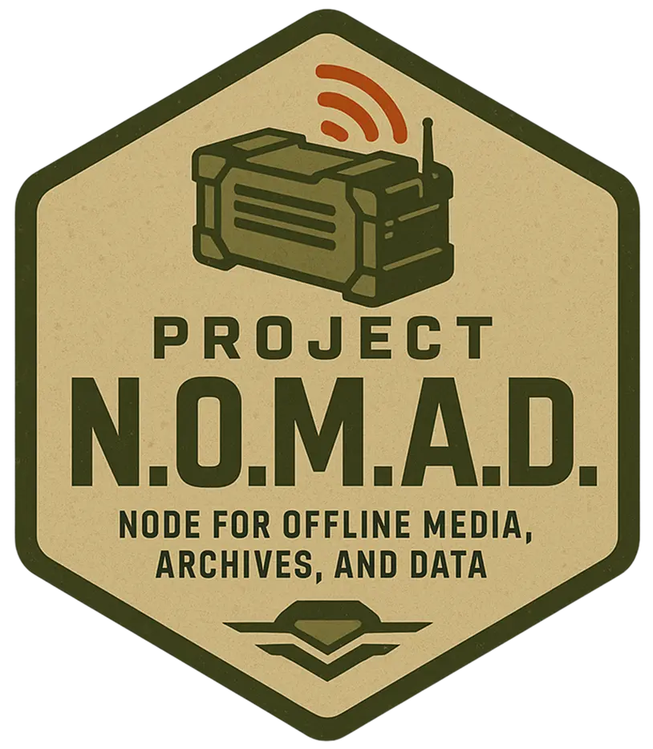

# VANGUARD RELAY
### Node for Offline Media, Archives, and Data

---

Vanguard Relay is an independent, offline-first derivative project based on Project NOMAD. It provides a browser-accessible node for offline knowledge, media, archives, local AI, maps, education, notes, data tools, and modular Docker applications.

## Core Capabilities

- **Relay Intelligence** — local AI chat with knowledge-base/RAG support.
- **Archives** — offline reference libraries and downloadable knowledge collections.
- **Learning** — offline educational resources and progress tracking.
- **Navigation** — downloadable offline maps.
- **Field Tools** — encryption, encoding, hashing, analysis, and utility tools.
- **Field Notes** — local Markdown notes.
- **Relay Benchmark** — hardware benchmarking and diagnostics.
- **Field Depot** — curated applications plus custom Docker containers.
- **Automatic Maintenance** — configurable updates for the node, installed applications, and offline content.
- **Deployment Protocol** — guided first-time setup.

## Installation

Vanguard Relay is designed for Debian-based systems and is accessed through a browser.

For source deployments, use the files in install/. The management interface is available on port 8080 by default.

## Licensing and Attribution

Vanguard Relay is an independent derivative project based on Project NOMAD. Project NOMAD is licensed under the Apache License 2.0. Required upstream copyright and license notices are retained in this repository, and third-party components remain subject to their respective licenses.

Vanguard Relay is not affiliated with or endorsed by Crosstalk Solutions.

See LICENSE and the in-application Legal Notices page for attribution details.

## Project Structure

- admin/ — Vanguard Relay management application.
- install/ — installation, maintenance, and Docker deployment tooling.
- collections/ — offline content collection definitions.
- .github/workflows/ — Vanguard Relay build automation.
